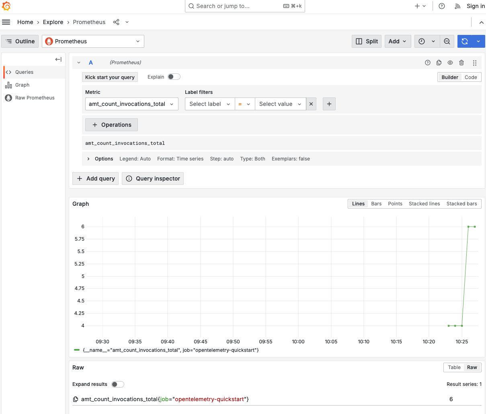
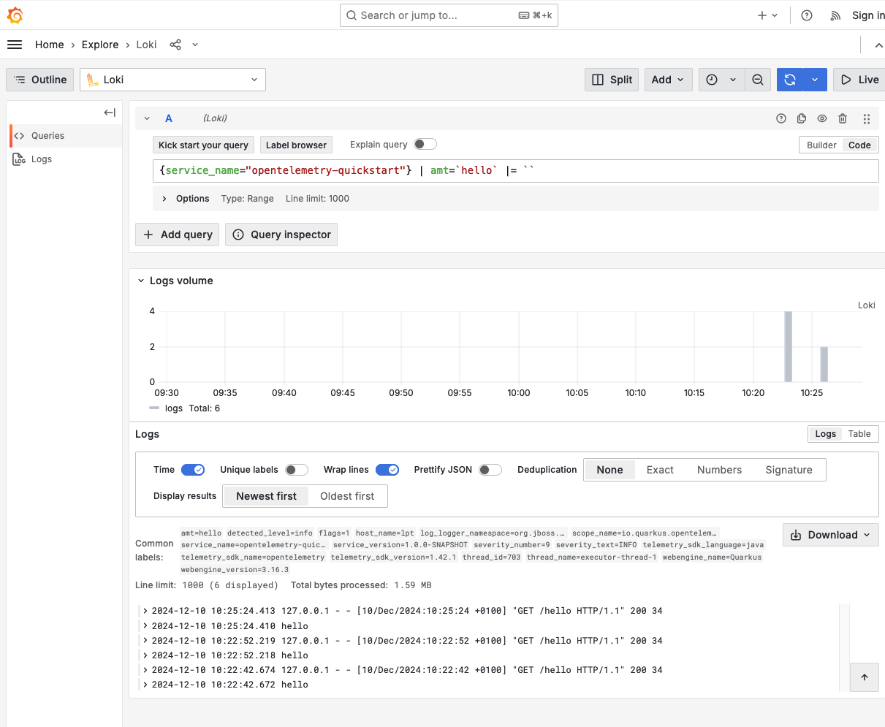
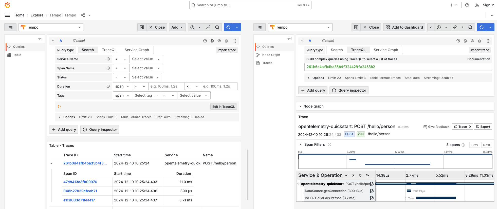

# `example-opentelemetry`
This project uses Quarkus, the Supersonic Subatomic Java Framework.

If you want to learn more about Quarkus, please visit its website: <https://quarkus.io/>.

## Running the application in dev mode

You can run your application in dev mode that enables live coding using:

```shell script
./mvnw compile quarkus:dev
```

> **_NOTE:_**  Quarkus now ships with a Dev UI, which is available in dev mode only at <http://localhost:8080/q/dev/>.

## Instructions

### Create activity
Using the following commands the necessary activity will be created:
```
curl localhost:8080/hello
curl -XPOST http://localhost:8080/hello/person
curl http://localhost:8080/hello/person/2
```
### Access Grafana
Open Grafana by looking at the dev-services either in the application logs or in quarkus dev-ui.

The goal is to explore the different signals, correlated them with the code and the application activity.

### Metrics

Open the relevant dashboard: Home -> Dashboards -> Quarkus Micrometer Metrics - OTLP.
Check the panels and their content.

In "Explore", selects "Prometheus" as datasource and create a query for the custom metric `amt-count`.



### Logs

In "Explore", selects "Loki" as datasource and create a query for the custom log field `amt`.



### Traces

In "Explore", selects "Tempo" as datasource and explore traces and their span to the JDBC datasource. Investigate the time taken for database queries.



## References
* https://quarkus.io/guides/opentelemetry
* https://quarkus.io/guides/observability-devservices
* https://quarkus.io/guides/opentelemetry-metrics
* https://quarkus.io/guides/opentelemetry-logging
* https://quarkus.io/guides/opentelemetry-tracing

