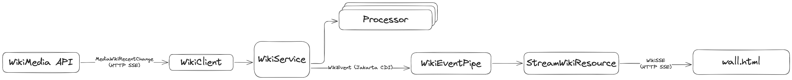
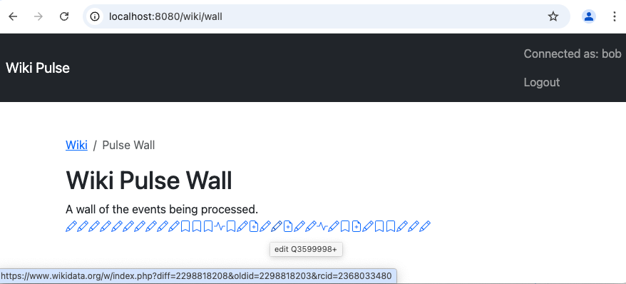
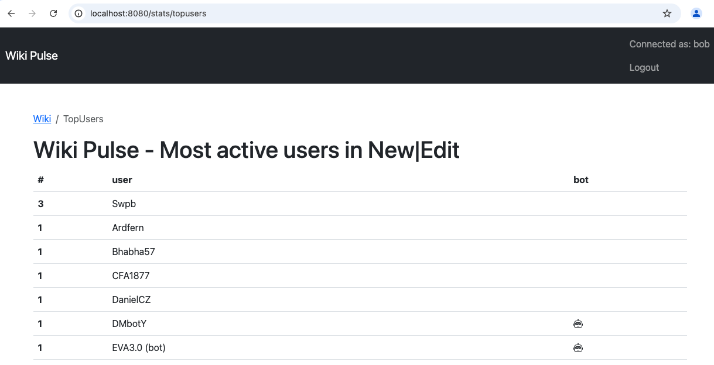

# Examen AMT 2024

## Conditions

* La durée de l'examen est de 2 heures.
* La documentation web est autorisée.
* Votre écran doit être visible pour les surveillants.
* Les agents IA sont autorisés que cela soit sur le web ou intégré à des outils IDE.
* Vous n'avez pas le droit de communiquer avec les autres étudiants ou des personnes externes.
* Toutes vos modifications doivent être commitées sur le repository GitHub Classroom avant la fin de l'examen.

## Introduction

Votre mission est de compléter des fonctionnalités dans l'application Wiki Pulse.
L'application permet de traiter et visualiser les événements issus de MediaWiki.
L'API utilisée dans l'application est décrite ici : https://wikitech.wikimedia.org/wiki/Event_Platform/EventStreams_HTTP_Service

Un événement MediaWiki est une action automatiquement émise qui peut être :
- une création de page (événement "new")
- une édition de page (événement "edit")
- un ajout, une modification ou une suppression d'une catégorie d'une page existante (événement "categorize")
- une action enregistrée dans les journaux du système, par exemple des actions administratives ou techniques (événement "log")

Par défaut l'application utilise une version mock de l'API avec Wiremock, qui tourne localement de manière transparente en mode `quarkus dev` et lors des tests.
Ainsi les événements traités sont établis à l'avance et le développement se fait indépendamment de l'API réelle.

L'examen est composé de plusieurs étapes indépendantes à réaliser sur la base du code existant.
En cas de blocage sur une étape, vous devriez pouvoir passer à l'étape suivante.
Les étapes sont données dans un ordre recommandé, toutefois elles peuvent être réalisées dans n'importe quel ordre.


Attention, vos modifications peuvent involontairement coupler certaines étapes entre elles.
De ce fait, prêtez attention à ne pas disperser vos implémentations au-delà du nécessaire.
Si une étape incomplète bloque les suivantes, commentez le code bloquant ou fixez des valeurs dans le code et documentez les problèmes rencontrés, afin de débloquer l'application.
N'hésitez pas à ajouter des commentaires dans votre code pour expliquer vos choix et vos décisions.

## Prérequis

L'application a été développée avec Java 21 et utilise Maven pour la gestion des dépendances.

Le projet peut être démarré en mode développement avec la commande suivante :

```bash
mvn compile quarkus:dev
```

## Informations de base

Le projet utilise Jakarta Persistence pour la persistance des données et Flyway pour la migration de la base de données.
Les dépendances (`pom.xml`), une configuration de base (`src/main/resources/application.properties`), ainsi qu'un schéma et des données de test (`src/main/resources/db/migration/V1.0__initialize_database.sql`) sont fournis.

Le projet utilise Jakarta RESTful Web Services et Qute templating.

Une fois démarrée l'application est disponible ici : http://localhost:8080/wiki

Les utilisateurs existants avec leur mot de passe sont :
- bob, test123
- ana, test123

## Qualité du code (1 point)

Le code que vous avez rédigé doit être lisible, documenté et bien formaté.

Il vous est demandé d'effectuer les tâches suivantes :
- [ ] Formatez le code que vous avez écrit.
- [ ] Assurez-vous que votre code est lisible et bien organisé (nommage, structure, etc.).
- [ ] Documentez votre code lorsque cela est nécessaire (Javadoc, commentaires, etc.).


## Étape 1 : Feature, enregistrement utilisateur (1 point)

Fonctionnalité : En tant qu'utilisateur, je peux m'enregistrer avec un nom d'utilisateur et mot de passe.

Il vous est demandé d'effectuer les tâches suivantes :
- [ ] Implémenter les templates Qute pour les pages suivantes :
  - [ ] Page d'enregistrement avec nom d'utilisateur et mot de passe.
  - [ ] Page d'erreur lorsque l'enregistrement échoue.
  - [ ] Page de succès lorsque l'enregistrement réussit.
- [ ] Implémenter le backend nécessaire afin de réaliser l'enregistrement et la redirection entre les pages.

Vos modifications devraient affecter les fichiers dans les dossiers suivants :
- `src/main/java/ch/heigvd/amt/user/`
- `src/main/resources/templates/user/register.html`


## Étape 2 : Bug, doublons des noms d'utilisateur (1 point)

Bug : Les utilisateurs peuvent s'enregistrer à double dans l'application, car l'unicité des noms d'utilisateurs n'est pas vérifiée.

Il vous est demandé d'effectuer les tâches suivantes :
- [ ] Résoudre ce bug dans le schéma avec une migration de la base de données.
- [ ] Modifier le code backend si nécessaire
- [ ] Modifier le test existant afin de s'adapter à la résolution.

Vos modifications devraient affecter les fichiers et dossiers suivants :
- `src/main/java/ch/heigvd/amt/user/`
- `src/main/resources/db/migration/V2.1__unique_username.sql`
- `src/test/java/ch/heigvd/amt/user/UniqueUsernameTest.java`

## Étape 3 : Feature, date du dernier login (1 point)

Fonctionnalité : En tant qu'administrateur, je peux savoir la date de la dernière connexion réussie de chaque utilisateur.

Il vous est demandé d'effectuer les tâches suivantes :
- [ ] Implémenter une migration du schéma afin que la date du dernier login puisse être sauvegardée pour chaque utilisateur.
- [ ] Compléter l'implémentation de la méthode `LastLoginRecorder.observeAuthenticationSuccess` afin de sauvegarder la date lors du login.

Les tentatives de connexions qui n'aboutissent pas ne changent pas la date sauvegardée.

Vos modifications devraient affecter les fichiers et dossiers suivants :
- `src/main/java/ch/heigvd/amt/user/`
- `src/main/java/ch/heigvd/amt/user/LastLoginRecorder.java`
- `src/main/resources/db/migration/V2.0__user_lastlogin.sql`

## Étape 4 : Feature, implémenter l'appel des `Processor` (1 point)

Le package `src/main/java/ch/heigvd/amt/wiki` propose une implémentation qui consomme les événements de l'API Wikimedia et devrait les distribuer aux différentes implémentations de l'interface `Processor`.

Un `Processor` a pour rôle de recevoir et traiter un événement.
Chaque implémentation de `Processor` fonctionne de manière indépendante des autres.

Il est possible d'utiliser Jakarta CDI pour récupérer toutes les beans d'un certain type dynamiquement.
Pour cela, vous devez injecter `Instance<Processor>` dans `WikiService` et itérer sur les instances de `Processor`pour les invoquer de façon synchrone.
De cette manière, `WikiService` ne dépendra pas directement des implémentations spécifiques de l'interface `Processor`.
Consultez les exemples de la documentation Jakarta CDI pour effectuer cette tâche.
https://jakarta.ee/specifications/cdi/4.0/jakarta-cdi-spec-4.0#programmatic_lookup

- [ ] Faire en sorte que les implémentations de `Processor` existantes soit des `bean` de Jakarta CDI.
- [ ] Implémenter l'appel de tous les processors dans `WikiService.callProcessors`
- [ ] Implémenter le traitement de l'annotation `HaltProcessing`, selon la JavaDoc de l'annotation, lors de l'appel des `Processor`.

Les tests suivants peuvent aider à valider votre implémentation :
- `src/test/java/ch/heigvd/amt/wiki/WikiProcessorTest.java`
- `src/test/java/ch/heigvd/amt/wiki/HaltProcessingTest.java`

Vos modifications devraient affecter plusieurs fichiers dans le dossier suivant :
- `src/main/java/ch/heigvd/amt/`

Voici l'architecture focalisée sur le flux des événements :



## Étape 5 : Feature, Wiki Pulse Wall (1 point)

Fonctionnalité : En tant qu'utilisateur, je peux voir les changements WikiMedia en temps réel sur une page web.

L'implémentation de `WikiService` émet des Jakarta Events `WikiEvent` pour chaque changement reçu de l'API Wikimedia.
La classe `WikiEventPipe` propose une implémentation partielle pour consommer ces événements Jakarta et les transmettre à un canal (`@Channel`) en mémoire afin de les rediriger vers un endpoint HTTP SSE (Server-Sent Events).
Finaliser l'implémentation afin que :

- [ ] La méthode `WikiEventPipe.onWikiEvent` soit correctement appelée lorsqu'un événement est déclenché par `WikiService`.
- [ ] Ajouter les champs `type` et `url` dans `WikiSse` et les assigner correctement.
- [ ] Finaliser l'implémentation de la vue afin de créer le mur de changement reçu de Wikimedia en temps réél.

Vos modifications devraient affecter les fichiers et dossiers suivants :
- `src/main/java/ch/heigvd/amt/wikisse`
- `src/main/resources/templates/wiki/wall.html`

Voici à quoi devrait ressembler la page, chaque icône est un lien URL en lien avec le changement.


La vidéo suivante (qui se trouve à la racine de ce projet) montre l'activation du `WikiService` qui déclenche le traitement des événements et leur affichage.
La page `Wiki Pulse Wall` affiche uniquement les nouveaux événements traités à partir de son ouverture.
[pulse_service_and_wall.mov](pulse_service_and_wall.mov)

## Étape 6 : Implémenter le top des utilisateurs actifs (1 point)

Fonctionnalité : En tant qu'utilisateur, je peux voir les contributeurs les plus actifs.

Créer une vue des contributeurs les plus actifs basée sur les événements de type `edit` et `new`.

Si, à l'étape 5, votre code ne parvient pas à appeler tous les Processor, assurez-vous au moins que `NewEditProcessor` soit exécuté.

Il vous est demandé d'effectuer les tâches suivantes :
- [ ] Implémenter la persistence des événements de type `edit` ou `new` dans la classe `NewEditProcessor` selon les entités existantes.
- [ ] Implémenter la requête nécessaire dans le service.
- [ ] Implémenter la vue des contributeurs les plus actifs.

L'implémentation doit tolérer de recevoir plusieurs fois le même événement avec le même identifiant.

Vos modifications devraient affecter les fichiers et dossiers suivants :
- `src/main/java/ch/heigvd/amt/db/NewEditProcessor.java`
- `src/main/java/ch/heigvd/amt/db/StatsResource.java`
- `src/main/java/ch/heigvd/amt/db/StatsService.java`
- `src/main/resources/templates/stats/topusers.html`


