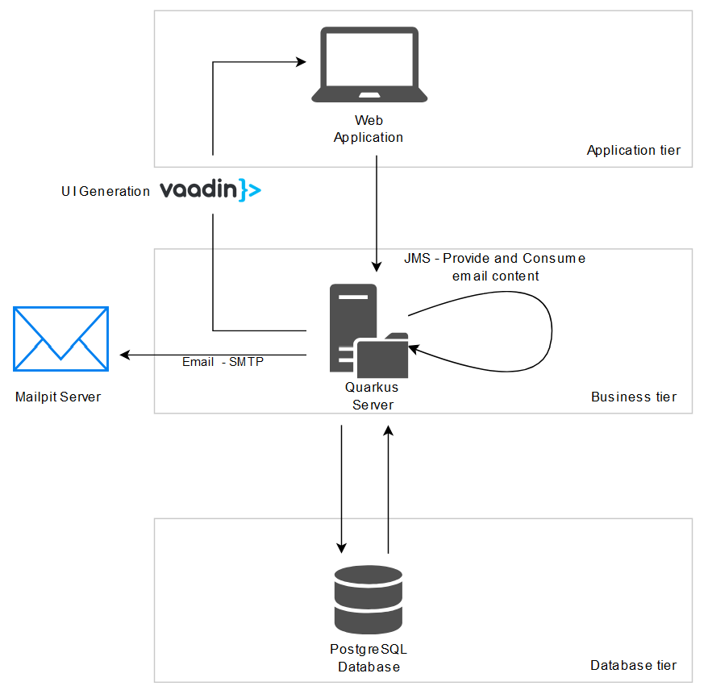
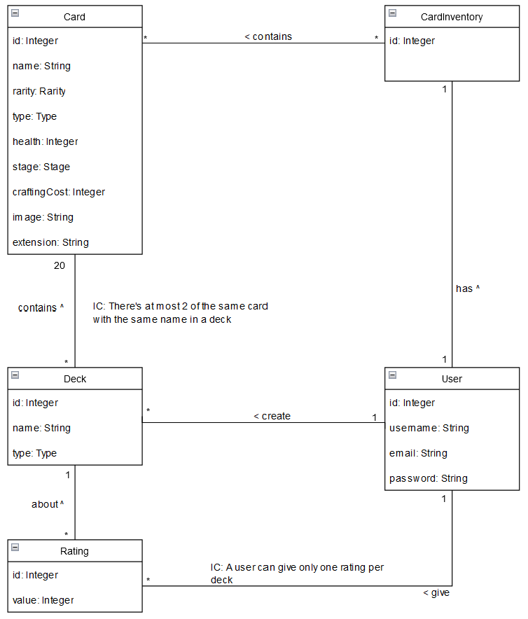

# Initial Report - Lab 3

> Authors : Tranchida Rachel, Junod Arthur, Ray Eva, Häffner Edwin

---

## Context

<!--A summary describing the purpose and business domain of the application.-->

### Pokémon Pocket TCG Builder (PTcgB)

Pokémon Pocket TCG Builder (PTcgB) is a web app designed as a companion to the Pokémon TCG Pocket application, allowing
users to
upload, share, and discover powerful decks. Whether you’re eager to showcase your unbeatable strategy or searching for
ways to counter a tricky opponent, PTcgB is the ultimate tool for enhancing your trading card game experience!

### Business domain

<!-- PARTIE métier, quelles entités vont intéragir dans notre application, carte, utilisateurs, etc. Voir DOMAIN DRIVEN DEVELOPEMENT-->

PTcgB's domain is the Pokémon Trading Card Game Pocket (TCGP).

#### Core Entities

- **User** : A user is a person who uses the application. They can create and share decks. They can also vote on other
  users' decks.
- **Deck** : A deck is a collection of cards that a user has created. They can be shared with other users.
- **Card** : A card is a Pokémon card that can be added to a deck. It has a name, a type, an image and a description.
- **Collection** : A collection is a list of cards that a user has. It is used to know which cards a user has and which
  deck they can build.

#### Features

- **Show rankings** : Users can see the most popular decks, based on the rating provided by other users.
- **Share decks** : Users can share their decks with other users.
- **Rate decks** : Users can rate other users' decks. The rating starts at 0 and can go up to 5.
- **Register owned cards** : Users can register the cards they own in the application. This will allow them to know
  which deck they can build.
- **Search decks** : Users can search for decks by type.
- **Know if a deck is buildable** : Users can know which decks they can build based on the cards they own.

#### Key terms

- **Pokémon** : A Pokémon is a creature that can be found in all the Pokémon games. A Pokémon has a type, like
  water or grass, that defines its strengths and weaknesses. For example, if a fire type Pokémon attacks a grass type
  Pokémon, it
  will deal more damage. On the contrary, if a water type Pokémon attacks a fire type Pokémon, it will also deal more
  damage.
- **Pokémon card** : A Pokémon card is a card used in the Pokémon Trading Card Game. It has a name, a type, attacks,
  special abilities.
  It can evolve into other Pokémon cards and can be used to build a deck.
- **Booster** : A booster is a pack of Pokémon cards that can be bought in the Pokémon TCGP application. It contains 5
  cards that are added to the user's collection when the booster is opened.
- **Deck** : A collection of cards that a user has created. It is used in combat between players or against an AI
  opponent.
  It is the main focus of our application as the act of building a deck can be a complex task when you want to optimize
  the synergies
  and combo there are among all cards.
- **Pokémon TCGP** : It is an acronym for the mobile game Pokémon Trading Card Game Pocket that released in autumn 2024.
  It is a digital version of the Pokémon Trading Card Game. The goal of the game is firstly to collect cards by opening
  boosters
  and secondly to build decks to compete against other players or against an AI opponent.
- **Stage** : A Pokémon can evolve into another Pokémon. The stage of a Pokémon is the level of evolution of the
  Pokémon.
  There are three stages: basic, stage 1 and stage 2.
- **Crafting cost** : If a user wants to use in its deck a card that he doesn't own, he can craft it. Crafting a card
  has a cost
  in the game's currency. The crafting cost is the amount of currency needed to craft a card.
- **Extension** : An extension represents a set of Pokémon cards that are released at the same time. For example, the "
  Genetic Apex"
  extension contains all the Pokémon cards that were released at the application's launch.

## User stories

<!--Template: “As [a persona], I want [to perform this action] so that [I can accomplish this goal].”-->

1. As a seasoned Pokémon TCGP player, I want to register my deck in the application so that other players can replicate
   it and use it.
2. As a seasoned Pokémon TCGP player, I want to be able to see other players' decks so that I can be aware of the meta
   and
   improve my decks.
4. As a seasoned Pokémon TCGP player, I want to be able to give feedbacks on others players' deck so that I can help
   them
   build a good deck.
4. As a new Pokémon TCGP player, I want to be able to see other players' decks so that I can get inspired.
5. As a new Pokémon TCGP player, I want to be able to share my decks so that I can have feedbacks on them from more
   experienced player.
6. As a Pokémon TCGP player, I want to be able to register the cards I have in the application so that I can know which
   deck I can build at the moment.
7. As a Pokémon TCGP player, I want to be able to search for decks by type so that I can find a deck that fits my play
   style.
8. As a Pokémon TCGP player, I want to be able to see the most popular decks so that I can know which decks are
   currently the best.

## New technology - Vaadin

<!--The chosen new technology that will be employed and presented by the group at the end of the lab.-->
[Vaadin](https://vaadin.com/) is a Java framework for building modern, responsive web applications with a server-side
architecture, enabling
developers to write UI logic entirely in Java. It provides a rich set of pre-designed components and easy
integration with Java backends, allowing for efficient development without needing to write HTML, JavaScript, or CSS
directly. In our case, we will use Vaddin Flow to build entirely the frontend of our application.

Vaadin is a solid choice for our application because it emphasises speed and efficiency. Its ready-made components and
full-stack framework can significantly accelerate our development, and will allow us to focus on the core logic of our
project rather than allocating excessive resources to UI elements.
Moreover, Vaadin is optimized for single-team handling of the entire application, from database interactions to the user
interface. It is particularly advantageous for a small, focused project like ours.

## Architecture

<!--Architecture, including main components, their relations, including the messaging flow.-->

The architecture of the application is divided into three main components: the frontend, the backend, and the database.
The frontend is developed with Vaadin Flow, the backend is developed using Java and the database is a PostgreSQL
database.

### Java Messaging Service (JMS)

JMS will be used to handle the emails sent to a user when one of their deck is rated by another user. The email contains
the rating given by the user, the rater's username and the deck's name. Different mails are sent depending on whether
the rater has submitted a rating for the first time or has updated their rating.

The trigger for sending the email is when a user clicks on the "submit" button after rating a deck in the UI. When this
happens, a message is sent to the JMS queue by a db service. The message will be sent in the receiving user's queue. The
consumer, uses a mail service, will then send the email to the user.

### Email

As mentioned earlier, emails are sent to users when their deck is rated. To implement this functionality, we used
Quarkus's [Mailer](https://quarkus.io/guides/mailer) service, which provides a simple and efficient way to send emails in Java applications. The email
includes details such as the rating given, the rater's username, and the deck's name.

The email-sending process is triggered by the JMS consumer when it receives a message from the user's queue. The mail
service then composes and sends the email based on the received message details.

Instead of configuring a real email server, [Mailpit](https://mailpit.axllent.org/) is used to test our email-sending functionality.
Mailpit is a local SMTP server designed for developers to intercept and view email communications in real time. It acts
as a fake email server, allowing us to inspect the content, headers, and details of the emails sent by our application
without actually delivering them to a recipient. The main advantage of using Mailpit is that it enables us to test our
email-sending functionality without the need for a real email server, which allows us to avoid configuring and
verifying access to an external email provider. Furthermore, every email is intercepted and displayed in the Mailpit
interface, providing us with a clear overview of the email content and structure.

### Authentication

To implement authentication, we tried to use the [Quarkus Spring Security](https://quarkus.io/extensions/io.quarkus/quarkus-spring-security/) extension.
However, we encountered some issues with the extension, and we were unable to successfully implement it in our
application. As a result, we decided to handle authentication manually by creating a custom authentication class that
verifies the user's state using Vaadin's session management.

To set the user's state, the login form manually checks if the user's credentials are correct. If they are, the user is
added to Vaadin's session and redirected to the main page. If the credentials are incorrect, an error message is
displayed on the login form.

As for the passwords, they are stored in the database using the BCrypt algorithm which is handy since BCrypt stores the salt in the hash itself.

We use the `UserHelper` class to manage the user's session state, including setting the current user and checking if a user is logged in.

## Data model

<!--Data model of the domain, the focus is on the main entities and relations. 
The diagram will likely evolve during the implementation.-->

The diagram will likely evolve during the implementation. To store the data, we will use a PostgreSQL database. To fill
the database, we will use the following github repository
that contains a dataset of Pokémon cards: https://github.com/chase-manning/pokemon-tcg-pocket-cards. This github
repository contains a JSON file with all the Pokémon cards that we will use to fill our database. We will use
the direct link to display the images of the cards in our application.

### Entity description

- **User** : A user is a person who uses the application. They can create and share decks. They can also vote on other
  users' decks.
- **Deck** : A deck is a collection of cards that a user has created. They can be shared with other users.
- **Card** : A card is a Pokémon card that can be added to a deck. It has a name, a type, an image and a description.
- **CardInventory** : A collection is a list of cards that a user has. It is used to know which cards a user has and
  which deck they can build.
- **Rating** : A deck rating is a rating given by a user to a deck. It contains the id of the user who rated the deck,
  the id of the deck and the rating given by the user.

<!--
### JMS 
on peut forwarder des events dans le backend au frontend avec JMS en utilisant SSE (Server Sent Events) ou Websockets.
Google Quarkus JMS SSE ! https://quarkus.io/guides/jms -->
